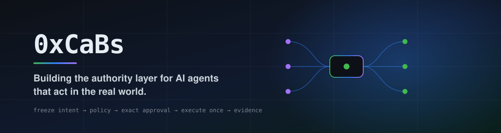
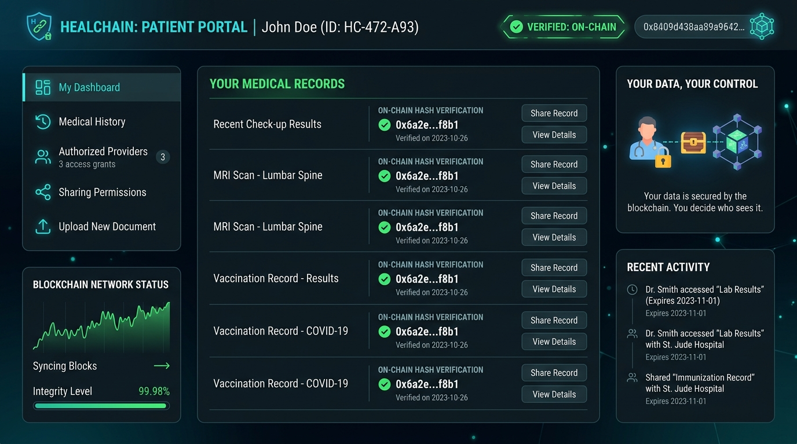
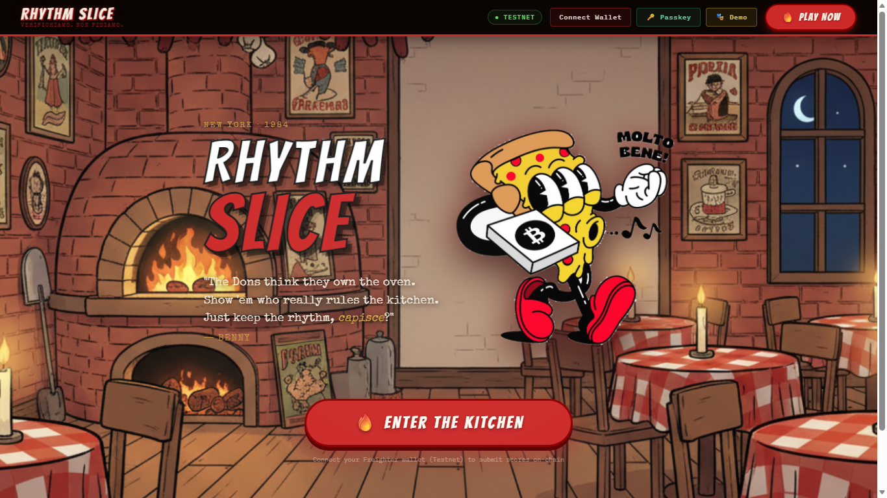
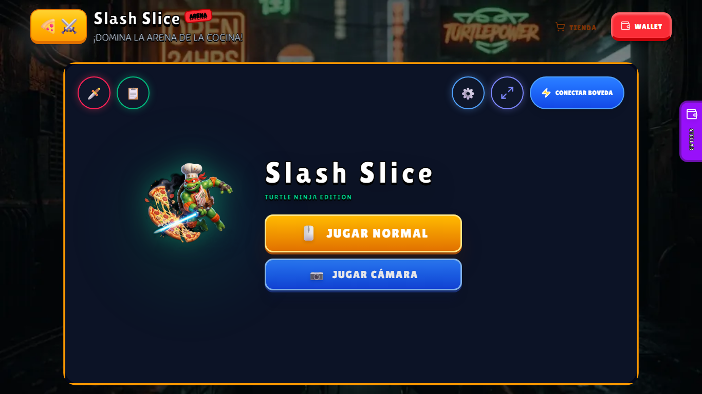

  <picture>
    <source media="(prefers-color-scheme: dark)" srcset="./banner-dark.svg">
    <source media="(prefers-color-scheme: light)" srcset="./banner-light.svg">
    
  </picture>

<h3 align="center">I build AI agents that act in the real world — and games that live on-chain.</h3>

  <a href="https://cabscrypto.github.io/CaBsCrypto/"><b>⚡ Interactive Portfolio</b></a> &nbsp;·&nbsp;
  <a href="https://x.com/CaBsCrypto">X</a> &nbsp;·&nbsp;
  <a href="mailto:brownsstudiocontact@gmail.com">Email</a>

---

<table>
  <tr>
    <td width="50%">
      
      <h3>🤖 Carmelita</h3>
      
AI agent that <b>books and pays for you, with limits</b>. Freeze intent → evaluate policy → exact approval → execute once → evidence. Replay-safe payments and on-chain receipts on Stellar.

      
<a href="https://agente-asistente.vercel.app"><b>→ Try it live</b></a> &nbsp;·&nbsp; <a href="https://github.com/CaBsCrypto/agente-asistente">repo</a>

    </td>
    <td width="50%">
      
      <h3>🌿 TrustLeaf</h3>
      
<b>Patient-owned medical records.</b> Consent as a transaction, not a promise. Hash on-chain in Soroban, data off-chain — <i>the content is erasable, the proof that nobody altered it is not.</i>

      
<a href="https://trustleaf-demo.vercel.app/verify/license/1"><b>→ Verify a licence</b></a> &nbsp;·&nbsp; <a href="https://github.com/CaBsCrypto/ficha-onchain">repo</a>

    </td>
  </tr>
  <tr>
    <td width="50%">
      
      <h3>🎵 Rhythm Slice</h3>
      
<b>ZK rhythm game on Stellar.</b> New York, 1984 — keep the kitchen's rhythm, slice on the beat and put your score on-chain. Passkey login, zero friction. A SpicyCrust game.

      
<a href="https://rhythmslice.spicycrust.com"><b>→ Play</b></a>

    </td>
    <td width="50%">
      
      <h3>🍕 Slash Slice Arena</h3>
      
<b>Slice pizzas with your hands.</b> 60 FPS MediaPipe hand-tracking in the browser, Privy auth, Soroban scoreboard. Turtle Ninja edition. A SpicyCrust game.

      
<a href="https://slashslice.spicycrust.com"><b>→ Play</b></a> &nbsp;·&nbsp; <a href="https://github.com/CaBsCrypto/pizzaninja">repo</a>

    </td>
  </tr>
</table>

---

  

  
    Solo founder · Santiago, Chile 🇨🇱 · Agent-to-business execution — <b>idempotency, policy, approval, evidence</b> 
    Since 2021 across LatAm: Stellar, Tellus Cooperative, Base, Avalanche, Immutable. 
    ⚠️ <b>Honest status:</b> payment and on-chain proofs run on <b>Stellar Testnet</b>. No mainnet payments, no paying customers yet.
  

